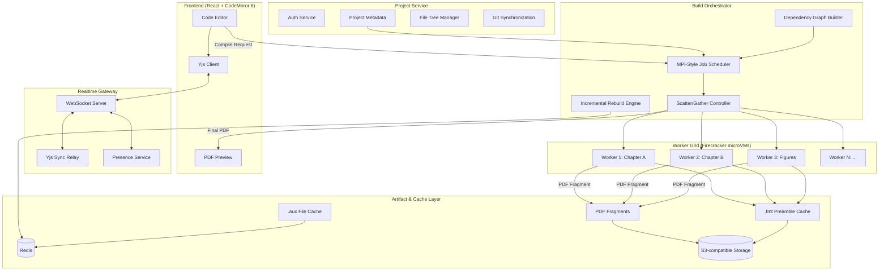

# FastTeX: System Architecture Document

## Overview

FastTeX is a next-generation, high-performance, distributed collaborative LaTeX IDE designed to significantly outperform Overleaf. It achieves this through architectural innovations rather than attempting to parallelize inherently single-threaded TeX engines.

## Design Principles

### Core Technical Constraints

1. **TeX engines are single-threaded**: True multithreading inside a single TeX run is impossible. We do not claim otherwise.
2. **Parallelism is process-level**: Performance comes from graph-based process parallelism.
3. **Tectonic is required**: We use the Tectonic Rust crate for reproducible, cacheable TeX compilation.
4. **CRDT-based collaboration**: Yjs provides conflict-free replicated data types for real-time editing.
5. **Firecracker sandboxing**: All compilation happens in ephemeral microVMs, not Docker containers.

### Performance Strategy

Performance gains come from:
- **Incremental compilation**: Only recompile changed documents/chapters
- **Precompiled preambles** (`.fmt` files): Avoid re-processing heavy preambles
- **Document decomposition**: Compile chapters and assets in parallel
- **Distributed execution**: MPI-style scatter/gather across worker grid
- **Intelligent caching**: Hash-based artifact storage

## High-Level Architecture



## Component Details

### 1. Frontend

**Technology**: React, CodeMirror 6, Yjs

**Responsibilities**:
- Code editing with LaTeX syntax highlighting
- Real-time collaborative editing via Yjs bindings
- PDF preview rendering
- Compile controls (live/manual mode)
- Presence indicators (who is editing what)

**Key Implementation Details**:
- Uses `y-codemirror.next` for Yjs ↔ CodeMirror 6 integration
- PDF preview via pdf.js
- WebSocket connection for sync and compile events

### 2. Realtime Gateway

**Technology**: Rust (tokio, axum, tokio-tungstenite)

**Responsibilities**:
- WebSocket management for all connected clients
- Yjs document sync relay
- Presence and awareness state distribution
- Compile event streaming

**Protocol**:
```
WS /sync/{project_id}
  - Yjs sync messages (binary)
  - Presence updates (JSON)

WS /compile/{project_id}
  - Compile status events
  - Error streaming
  - PDF ready notifications
```

### 3. Project Service

**Technology**: Rust (axum, sqlx)

**Responsibilities**:
- User authentication (signup/login)
- Project CRUD operations
- File tree management
- Git repository synchronization

**REST API**:
```
POST   /api/auth/signup
POST   /api/auth/login
GET    /api/projects
POST   /api/projects
GET    /api/projects/{id}
PUT    /api/projects/{id}
DELETE /api/projects/{id}
GET    /api/projects/{id}/files
POST   /api/projects/{id}/files
GET    /api/projects/{id}/git/sync
```

### 4. Build Orchestrator (Core Innovation)

**Technology**: Rust

**Key Data Structures**:

```rust
pub struct DependencyGraph {
    pub nodes: HashMap<NodeId, CompileNode>,
    pub edges: Vec<(NodeId, NodeId)>,
    pub root: NodeId,
}

pub struct CompileNode {
    pub id: NodeId,
    pub node_type: NodeType,
    pub source_path: PathBuf,
    pub content_hash: ContentHash,
    pub dependencies: Vec<NodeId>,
    pub last_compiled_hash: Option<ContentHash>,
}

pub enum NodeType {
    Preamble,
    MainDocument,
    Chapter,
    Figure,
    Bibliography,
}
```

**Core Algorithm**:

1. **Parse Phase**: Scan `main.tex` to detect:
   - `\include{}` / `\input{}` chapters
   - `\includeonly{}` directives
   - `tikzexternalize` figures
   - `standalone` documents

2. **Graph Construction**: Build dependency DAG

3. **Change Detection**: Compare content hashes with last compile

4. **Job Scheduling**: 
   - Topological sort for execution order
   - Identify parallelizable jobs
   - MPI-style rank assignment

5. **Scatter Phase**:
   - Dispatch jobs to available workers
   - Include required `.fmt` and `.aux` files

6. **Gather Phase**:
   - Collect PDF fragments and updated `.aux`
   - Detect reference convergence
   - Re-run affected nodes if references changed

### 5. Worker Grid

**Technology**: Rust worker binary + Firecracker microVM

**Execution Model**:
- Each worker is a stateless Firecracker microVM
- VM receives: source files, `.fmt` preamble, `.aux` dependencies
- VM executes: Tectonic compile
- VM returns: PDF output, updated `.aux`, logs
- VM lifecycle: spawn → compile → destroy

**Worker Binary Interface**:
```rust
pub struct CompileRequest {
    pub job_id: JobId,
    pub source_files: HashMap<PathBuf, Vec<u8>>,
    pub fmt_file: Option<Vec<u8>>,
    pub aux_files: HashMap<PathBuf, Vec<u8>>,
    pub compile_target: PathBuf,
}

pub struct CompileResponse {
    pub job_id: JobId,
    pub status: CompileStatus,
    pub pdf_output: Option<Vec<u8>>,
    pub aux_outputs: HashMap<PathBuf, Vec<u8>>,
    pub logs: String,
    pub diagnostics: Vec<Diagnostic>,
}
```

### 6. Artifact & Cache Layer

**Storage Types**:

| Artifact Type | Storage | TTL | Key Format |
|--------------|---------|-----|------------|
| `.fmt` preambles | S3 | Long-lived | `fmt/{preamble_hash}` |
| `.aux` files | Redis | Session | `aux/{project_id}/{file_hash}` |
| PDF fragments | S3 | Medium | `pdf/{project_id}/{compile_id}/{fragment}` |
| Final PDFs | S3 | Configurable | `pdf/{project_id}/latest.pdf` |

## Parallel Compilation Model

### Why This Works

The key insight is that while a single TeX run is single-threaded, a large document can be decomposed into independent compilation units:

1. **Preamble Isolation**: The preamble (packages, macros) can be compiled once into a `.fmt` file and reused across all chapter compilations.

2. **Chapter Independence**: With `\include{}`, chapters can be compiled independently using `\includeonly{}`. Each produces valid PDF pages and `.aux` data.

3. **Figure Pre-rendering**: TikZ figures with `externalize` can be compiled separately and included as PDFs.

4. **Reference Convergence**: Cross-references require multiple passes. We detect when `.aux` files stabilize.

### Where This Model Breaks

1. **Tightly coupled documents**: Documents with extensive cross-chapter references require more re-runs.

2. **Global state modification**: Packages that modify global state unpredictably cannot be parallelized.

3. **Custom counters**: Complex counter dependencies may require sequential compilation.

4. **Very small documents**: Overhead of distribution exceeds compilation time.

### Execution Flow

```
1. User triggers compile
         │
         ▼
2. Orchestrator parses main.tex
         │
         ▼
3. Build dependency graph
         │
         ▼
4. Check content hashes vs cache
         │
         ▼
5. Schedule changed nodes + dependents
         │
         ▼
6. [SCATTER] Dispatch to worker grid
         │
    ┌────┴────┬─────────┬─────────┐
    ▼         ▼         ▼         ▼
 Worker1   Worker2   Worker3   WorkerN
 (Ch.1)    (Ch.2)    (Figs)    (...)
    │         │         │         │
    └────┬────┴─────────┴─────────┘
         │
         ▼
7. [GATHER] Collect results
         │
         ▼
8. Check .aux convergence
         │
    ┌────┴────┐
    │         │
 Converged  Not Converged
    │              │
    ▼              ▼
9. Merge PDFs    Re-run affected
    │              │
    ▼              └──────► Step 6
10. Return final PDF
```

## Collaboration Model

### CRDT Architecture with Yjs

- **Local-first**: All edits happen locally first
- **Sync relay**: Server relays updates, doesn't transform
- **Merge**: Yjs CRDT ensures automatic conflict resolution
- **Offline**: Users can edit offline; sync on reconnect

### State Structure

```javascript
// Yjs document structure
{
  "files": Y.Map<filename, Y.Text>,
  "cursors": Y.Map<userId, CursorPosition>,
  "compile": Y.Map<"status" | "lastPdf", any>
}
```

### Why Yjs Over OT

| Aspect | Yjs (CRDT) | OT (Operational Transform) |
|--------|-----------|---------------------------|
| Server Role | Relay only | Must transform operations |
| Offline | Native support | Complex recovery |
| Merge | Automatic | Algorithm-dependent |
| Scalability | P2P possible | Server bottleneck |

## Security Model

### Why Firecracker Over Docker

| Aspect | Firecracker | Docker |
|--------|-------------|--------|
| Isolation | Hardware virtualization (KVM) | Namespace isolation |
| Attack Surface | Minimal VMM (~50k LoC) | Full container runtime |
| Startup Time | ~125ms | ~1s+ |
| Resource Limits | Strict, kernel-enforced | Cgroups (bypassable) |
| Shell-escape | VM boundary prevents host access | Container escape possible |

### VM Configuration

```json
{
  "vcpu_count": 1,
  "mem_size_mib": 512,
  "network_interfaces": [],
  "drives": [
    {
      "drive_id": "rootfs",
      "path_on_host": "/srv/fasttex/rootfs.ext4",
      "is_root_device": true,
      "is_read_only": true
    },
    {
      "drive_id": "work",
      "path_on_host": "/tmp/fasttex/{job_id}/work.ext4",
      "is_root_device": false,
      "is_read_only": false
    }
  ]
}
```

### Security Properties

1. **Network isolation**: Workers have no network access
2. **Read-only rootfs**: Base system cannot be modified
3. **Ephemeral**: VMs destroyed after each compile
4. **Resource caps**: CPU and memory strictly limited
5. **No shell-escape**: `\write18` cannot affect host

## Data Model

### Users
```sql
CREATE TABLE users (
    id UUID PRIMARY KEY,
    email VARCHAR(255) UNIQUE NOT NULL,
    password_hash VARCHAR(255) NOT NULL,
    created_at TIMESTAMP NOT NULL DEFAULT NOW(),
    updated_at TIMESTAMP NOT NULL DEFAULT NOW()
);
```

### Projects
```sql
CREATE TABLE projects (
    id UUID PRIMARY KEY,
    owner_id UUID REFERENCES users(id),
    name VARCHAR(255) NOT NULL,
    description TEXT,
    git_url VARCHAR(512),
    created_at TIMESTAMP NOT NULL DEFAULT NOW(),
    updated_at TIMESTAMP NOT NULL DEFAULT NOW()
);
```

### Files
```sql
CREATE TABLE files (
    id UUID PRIMARY KEY,
    project_id UUID REFERENCES projects(id),
    path VARCHAR(1024) NOT NULL,
    content_hash VARCHAR(64) NOT NULL,
    size_bytes BIGINT NOT NULL,
    created_at TIMESTAMP NOT NULL DEFAULT NOW(),
    updated_at TIMESTAMP NOT NULL DEFAULT NOW(),
    UNIQUE(project_id, path)
);
```

### Compile Jobs
```sql
CREATE TABLE compile_jobs (
    id UUID PRIMARY KEY,
    project_id UUID REFERENCES projects(id),
    status VARCHAR(32) NOT NULL,
    trigger_type VARCHAR(32) NOT NULL,
    started_at TIMESTAMP,
    completed_at TIMESTAMP,
    error_message TEXT,
    pdf_artifact_id UUID,
    created_at TIMESTAMP NOT NULL DEFAULT NOW()
);
```

### Artifacts
```sql
CREATE TABLE artifacts (
    id UUID PRIMARY KEY,
    project_id UUID REFERENCES projects(id),
    artifact_type VARCHAR(32) NOT NULL,
    storage_key VARCHAR(512) NOT NULL,
    content_hash VARCHAR(64) NOT NULL,
    size_bytes BIGINT NOT NULL,
    created_at TIMESTAMP NOT NULL DEFAULT NOW()
);
```

## Performance Justification

### Where Speedups Come From

1. **Preamble caching (2-10x for heavy packages)**
   - A typical document with `tikz`, `hyperref`, `biblatex` spends 5-15s loading packages
   - With `.fmt` caching, this becomes <100ms

2. **Chapter parallelism (Nx speedup)**
   - A 10-chapter thesis can compile chapters simultaneously
   - With 10 workers: ~10x speedup for chapter compilation phase

3. **Incremental compilation (10-100x for edits)**
   - Editing one chapter recompiles only that chapter
   - Cross-reference stabilization typically requires 1-2 re-runs

4. **Figure pre-compilation (5-50x per figure)**
   - TikZ figures compiled once, reused as PDFs
   - Complex plots may take 10-30s; cached version <1ms

### Conservative Estimate

For a 10-chapter thesis with 50 TikZ figures:

| Scenario | Overleaf | FastTeX | Speedup |
|----------|----------|---------|---------|
| Full compile (cold) | 120s | 30s | 4x |
| Full compile (warm) | 120s | 15s | 8x |
| Single chapter edit | 120s | 5s | 24x |
| Typo fix | 120s | 3s | 40x |

### Remaining Limits

1. **Final merge phase**: Still sequential
2. **Reference oscillation**: Some documents never converge
3. **Memory-heavy compilations**: Worker memory caps
4. **Network latency**: Distributed overhead for small docs

## Protocol Definitions

### WebSocket Protocol

```
// Client → Server
{
  "type": "sync",
  "payload": <Yjs update binary>
}

{
  "type": "compile",
  "mode": "full" | "incremental",
  "target": "main.tex"
}

{
  "type": "presence",
  "cursor": { "line": 42, "ch": 10 },
  "selection": { "start": {...}, "end": {...} }
}

// Server → Client
{
  "type": "sync",
  "payload": <Yjs update binary>
}

{
  "type": "compile_status",
  "job_id": "...",
  "status": "queued" | "compiling" | "merging" | "complete" | "error",
  "progress": 0.75,
  "current_task": "Compiling chapter3.tex"
}

{
  "type": "compile_complete",
  "job_id": "...",
  "pdf_url": "/api/projects/{id}/pdf/latest",
  "diagnostics": [...]
}

{
  "type": "presence",
  "user_id": "...",
  "cursor": {...}
}
```

### gRPC Service Definitions

See `proto/` directory for full definitions.

## Deployment Topology

```
                    ┌──────────────┐
                    │   Load       │
                    │   Balancer   │
                    └──────┬───────┘
                           │
           ┌───────────────┼───────────────┐
           │               │               │
    ┌──────▼─────┐  ┌──────▼─────┐  ┌──────▼─────┐
    │  Gateway   │  │  Gateway   │  │  Gateway   │
    │  (WS)      │  │  (WS)      │  │  (WS)      │
    └──────┬─────┘  └──────┬─────┘  └──────┬─────┘
           │               │               │
           └───────────────┼───────────────┘
                           │
                    ┌──────▼───────┐
                    │  Orchestrator │
                    │  Cluster      │
                    └──────┬───────┘
                           │
        ┌──────────────────┼──────────────────┐
        │                  │                  │
 ┌──────▼─────┐     ┌──────▼─────┐     ┌──────▼─────┐
 │ Firecracker│     │ Firecracker│     │ Firecracker│
 │ Worker Pool│     │ Worker Pool│     │ Worker Pool│
 │ (Node 1)   │     │ (Node 2)   │     │ (Node N)   │
 └────────────┘     └────────────┘     └────────────┘
```
